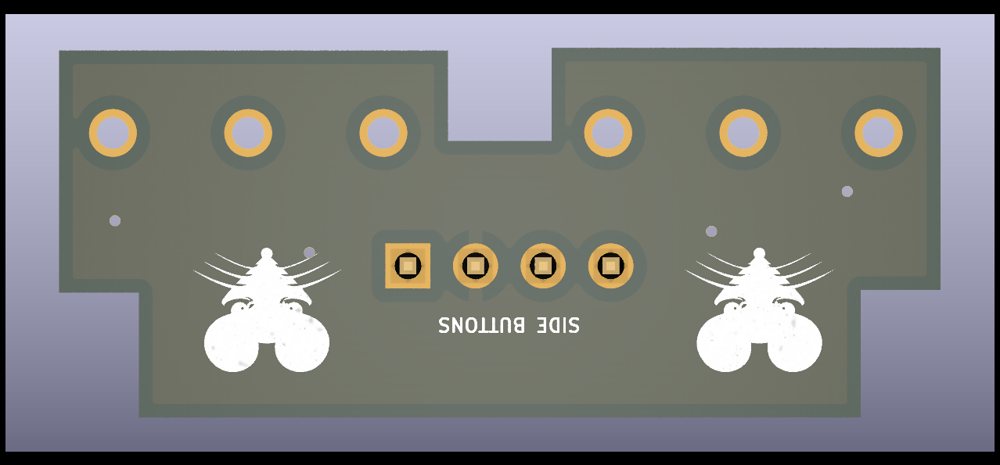

# Awesome gaming mouse

## Members

- Erik Serrander
- eriser-8@student.ltu.se
  
- Ivar Jönsson
- ivajns-9@student.ltu.se

## High level specification

### Basic
- Left and right click
- relative position

### Higher
- scroll wheel
- macro system
- Side buttons

### Stretch
- Computer communication
- LEDs, i.e. debug/ui
- Rumble motor
- Perfect spray

### Implementation
- Unit testing
- Cuntinuous integration

## Specification9
---
## Mouse buttons
The buttons used are [D2F-01F](https://www.elfa.se/sv/mikrobrytare-d2f-100ma-1co-74n-kolv-omron-electronic-components-d2f-01f/p/11082662?track=true&no-cache=true&marketingPopup=false) since these are well regarded by users.
We have decided to have 4 main buttons on the mouse, 2 on the front and 2 on the side.
## Side buttons 

To reduce the bouncing of the buttons a 10u capacitor is places to ground from the signal trace. This will allow the signal to be pulled low for high frequencies. 

To drive the buttons a 5v voltage is used with a series resistor of 4.7 k to limit the current to close to 1mA. The mosfet used to limit the output acts as a decoupler thus not draining anny current ( in theory ).

## Front buttons

## Mouse wheel

The [mouse wheel](https://se.rs-online.com/web/p/mechanical-rotary-encoders/7295545) is also debounced using the same capacitor values as the mouse button. This should not be as needed but better safe than sorry.

The mouse wheel also uses the same nfet to step down the voltage.

## Rumble motor

## Main board

## Case 
We will base our case on this moddel of the [g305](https://www.thingiverse.com/thing:3969266)
with this [base](https://www.thingiverse.com/thing:3564894).

The stl files can be found in our [models folder](model/).

## Grading

- Erik Serrander
  - Expected contributions towards grade 4
    - side buttons
    - diodes
  - Expected contributions towards grade 5
    - Computer communication
    - Rumble motor
  
- Ivar Jönsson
  - Expected contributions towards grade 4
    - PCB layout
      - Itterative design using a 3d printer to validate pcb fitting and footprint layout
      - Ease of assembly
    - Case customization 
      - Mountingholes and posibility to use a usb cable
    - Mouse wheel
      - Selecting a rotary encoder
    - diodes
      - status LEDs to validate voltage sections
  - Expected contributions towards grade 5
    - Computer communication
    - DPI configuration
    - Perfect spray
      - This might not be applicable. 
